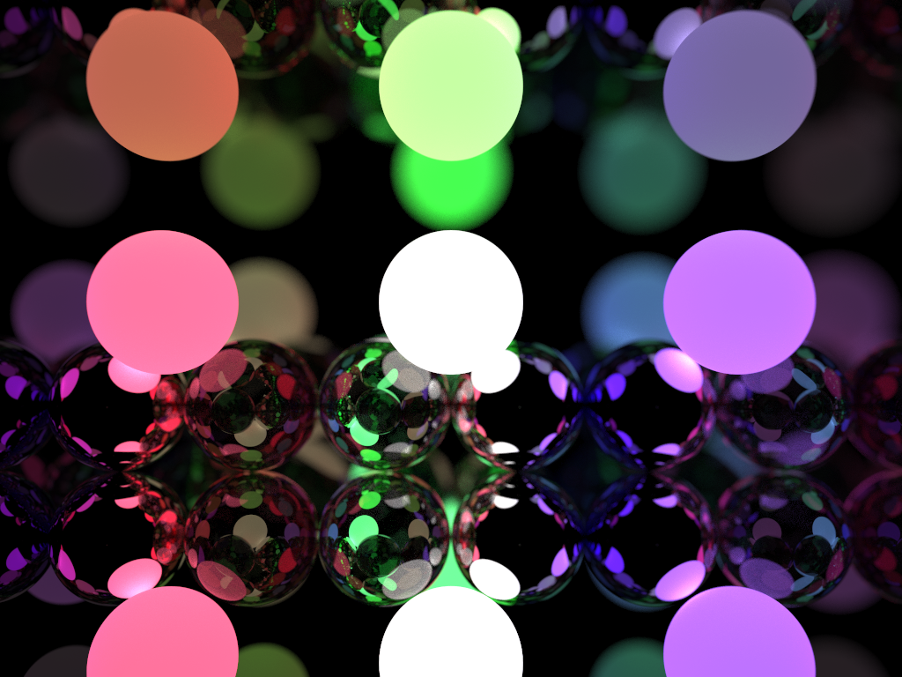

# CPU Path Tracer
This builds upon [smallpt](https://www.kevinbeason.com/smallpt/) and borrows a few things from
[Ray Tracing in One Weekend](https://raytracing.github.io/books/RayTracingInOneWeekend.html):
* The camera(I just couldn't understand all the magic constants in smallpt)
* The formulas for dielectrics and lambertian reflection

I ultimately plan to port this to the GPU, but until then I need to sort out some other things:
* Implement a BVH for fast intersection testing
* Make the rendering process progressive
* Probably replace the current method for random number generation(maybe something like a xorshift will be much faster)

